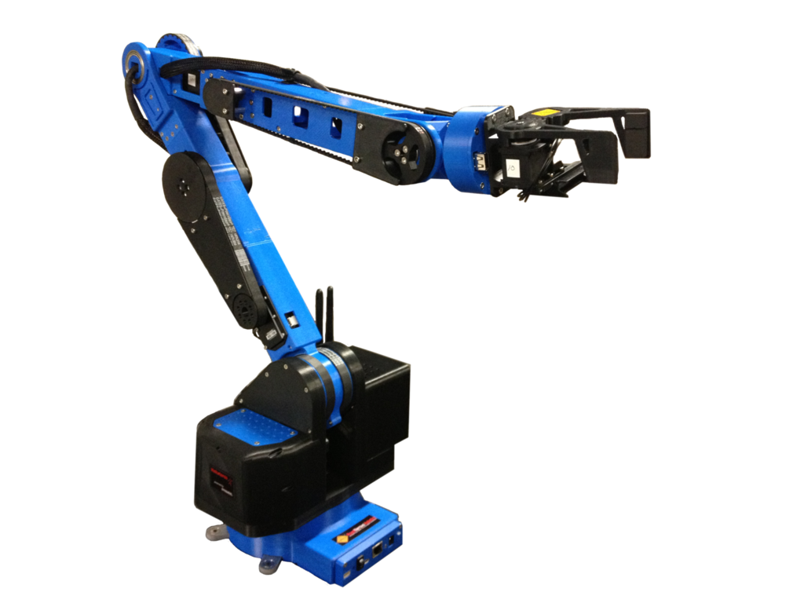

# Physical Computing & Tangible Media

## What is it?

## What can you do with it?

+ [Kaho Abe's Hit Me](http://kahoabe.net/portfolio/hit-me/)
+ [Morehshin Allahyari's Material Speculation](http://www.morehshin.com/material-speculation-isis/)
+ [Tristan Perich's Microtonal Wall](https://vimeo.com/45225412)
+ [Allison Burtch's Log Jammer](http://www.allisonburtch.net/log-jammer/)
+ [Camille Utterback's Text Rain](https://www.youtube.com/watch?v=f_u3sSffS78)
+ [Quayola](https://www.quayola.com/laocoon-d20-q1/)
	+ [Fabrication Technique](https://vimeo.com/122539419)
+ [Contestational Robotics](https://vimeo.com/6070459)
+ [Nintendo Labo](https://labo.nintendo.com/)

## My Work

+ Grayson Earle
+ www.graysonearle.com
+ @prismspecs / @graysonearle
+ [All City Express](http://graysonearle.com/events/)
+ [The Illuminator](http://graysonearle.com/the-illuminator/)
+ [WURM](http://graysonearle.com/wurm/)
+ [Brooklyn Gaze](http://graysonearle.com/brooklyn-gaze/)
+ [Ceremony of Innocence](http://graysonearle.com/ceremony/)

## Student Work

+ [Nick Demopoulos](http://graysonearle.com/nick-demopoulos-physcom/)
+ [James Bayard](http://graysonearle.com/james-bayard-physcom/)
+ [Matthew Galindo](http://graysonearle.com/matthew-galindo-physcom/)
+ [Andy Ralph](http://graysonearle.com/andy-ralph-physcom/)
+ [Rebecca Posner](http://graysonearle.com/physical-computing-rebecca-posner/)